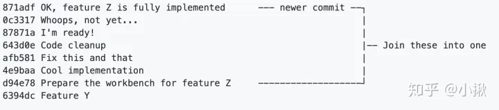
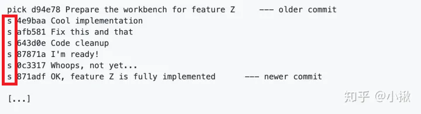

# 修改commit comment

### 1.修改最近一次commit comment

``git commit --amend``

---

# 合并多个提交

合并下图**7**个commit

1. 找到前一个（第**8**个）commit
   运行命令：``git rebase -i 6394dc``
2. 修改每一行(除了第一行)的第一个单词**pick**为**s**，如下图
   
3. 保存关闭修改后，修改弹出框的commit comment信息，保存关闭

> pick：保留该 commit
> squash：将该 commit 和前一个 commit 合并

---

# .gitignore文件不起作用

0. 进入项目路径
1. 清除本地当前的Git缓存
   ``git rm -r --cached .``
2. 应用.gitignore等本地配置文件重新建立Git索引
   ``git add .``
3. （可选）提交当前Git版本并备注说明
   ``git commit -m 'update .gitignore'``
