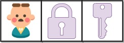

# 深度优先搜索

## [获取所有钥匙的最短路径](https://leetcode.cn/problems/shortest-path-to-get-all-keys/)
---

给定一个二维网格 grid ，其中：

* '.' 代表一个空房间
* '#' 代表一堵
* '@' 是起点
* 小写字母代表钥匙
* 大写字母代表锁

我们从起点开始出发，一次移动是指向四个基本方向之一行走一个单位空间。我们不能在网格外面行走，也无法穿过一堵墙。如果途经一个钥匙，我们就把它捡起来。除非我们手里有对应的钥匙，否则无法通过锁。

假设 k 为 钥匙/锁 的个数，且满足 1 <= k <= 6，字母表中的前 k 个字母在网格中都有自己对应的一个小写和一个大写字母。换言之，每个锁有唯一对应的钥匙，每个钥匙也有唯一对应的锁。另外，代表钥匙和锁的字母互为大小写并按字母顺序排列。

返回获取所有钥匙所需要的移动的最少次数。如果无法获取所有钥匙，返回 -1 。
 
**示例 1：**


    输入：grid = ["@.a.#","###.#","b.A.B"]
    输出：8
    解释：目标是获得所有钥匙，而不是打开所有锁。

**示例 2：**


    输入：grid = ["@..aA","..B#.","....b"]
    输出：6

**示例 3:**



    输入: grid = ["@Aa"]
    输出: -1
 
>提示：  
>m == grid.length  
>n == grid[i].length  
>1 <= m, n <= 30  
>grid[i][j] 只含有 '.', '#', '@', 'a'-'f' 以及 'A'-'F'  
>钥匙的数目范围是 [1, 6]   
>每个钥匙都对应一个 不同 的字母  
>每个钥匙正好打开一个对应的锁  


??? tip "思路"

    1. 求最短路径（用BFS）
    2. 存在重复经过一个点的情况，使用状态压缩过滤（如果在这个点拥有不同的钥匙，则可以通过，否则不能通过）

??? example "示例代码"

    ```python
    class Solution:
        def shortestPathAllKeys(self, grid: List[str]) -> int:
            iStart,jStart=-1,-1
            key=0
            for i in range(len(grid)):
                for j in range(len(grid[0])):
                    if grid[i][j]=='@':
                        iStart,jStart=i,j
                    elif 'a'<=grid[i][j]<='z':
                        t=ord(grid[i][j])-ord('a')
                        key|=(1<<t)
            dist=dict()
            state=0
            dist[(iStart,jStart,state)]=0
            q=deque([[iStart,jStart,state]])
            while len(q):
                i,j,state=q.popleft()            
                for x,y in [[i,j-1],[i,j+1],[i-1,j],[i+1,j]]:
                    if 0<=x<len(grid) and 0<=y<len(grid[0]) and grid[x][y]!='#':
                        if not grid[x][y].isalpha(): # . @
                            if (x,y,state) not in dist:
                                dist[(x,y,state)]=dist[(i,j,state)]+1
                                q.append([x,y,state])
                        else:
                            if grid[x][y].islower(): # key
                                t=ord(grid[x][y])-ord('a')
                                t=state|(1<<t)
                                if (x,y,t) not in dist:
                                    dist[(x,y,t)]=dist[(i,j,state)]+1
                                    q.append([x,y,t])
                                    if t==key:
                                        return dist[(x,y,t)]
                            else: # lock
                                t=ord(grid[x][y])-ord('A')
                                if (state>>t)&1 and (x,y,state) not in dist:
                                    dist[(x,y,state)]=dist[(i,j,state)]+1
                                    q.append([x,y,state])
            return -1
    ```
