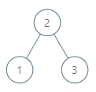

# 二叉树

## [二叉搜索树中的中序后继](https://leetcode.cn/problems/P5rCT8/)
---
给定一棵二叉搜索树和其中的一个节点 p ，找到该节点在树中的中序后继。如果节点没有中序后继，请返回 null 。

节点 p 的后继是值比 p.val 大的节点中键值最小的节点，即按中序遍历的顺序节点 p 的下一个节点。

 
**示例 1：**



    输入：root = [2,1,3], p = 1
    输出：2
    解释：这里 1 的中序后继是 2。请注意 p 和返回值都应是 TreeNode 类型。

**示例 2：**


    输入：root = [5,3,6,2,4,null,null,1], p = 6
    输出：null
    解释：因为给出的节点没有中序后继，所以答案就返回 null 了。
     

>提示：  
>树中节点的数目在范围 [1, 104] 内。  
>-105 <= Node.val <= 105  
>树中各节点的值均保证唯一。  

??? tip "思路"

    TODO

??? example "示例代码"

    ```python
    class Solution:
        def inorderSuccessor(self, root: 'TreeNode', p: 'TreeNode') -> 'TreeNode':
            self.target=p
            self.find=False
            self.res=None
            self.dfs(root)
            return self.res
        
        def dfs(self,root):
            
            if root is not None:
                self.dfs(root.left)
                if self.res is not None:
                    return
                if self.find and root.val!=self.target.val:
                self.res=root
                return
                if root.val==self.target.val:
                    self.find=True
            
                self.dfs(root.right)
    ```

## [删除二叉搜索树中的节点](https://leetcode.cn/problems/delete-node-in-a-bst/)
---

给定一个二叉搜索树的根节点 root 和一个值 key，删除二叉搜索树中的 key 对应的节点，并保证二叉搜索树的性质不变。返回二叉搜索树（有可能被更新）的根节点的引用。

一般来说，删除节点可分为两个步骤：

1. 首先找到需要删除的节点；
2. 如果找到了，删除它。
 

**示例 1:**


    输入：root = [5,3,6,2,4,null,7], key = 3
    输出：[5,4,6,2,null,null,7]
    解释：给定需要删除的节点值是 3，所以我们首先找到 3 这个节点，然后删除它。
    一个正确的答案是 [5,4,6,2,null,null,7], 如下图所示。
    另一个正确答案是 [5,2,6,null,4,null,7]。


**示例 2:**


    输入: root = [5,3,6,2,4,null,7], key = 0
    输出: [5,3,6,2,4,null,7]
    解释: 二叉树不包含值为 0 的节点

**示例 3:**

    输入: root = [], key = 0
    输出: []
 

>提示:  
>节点数的范围 [0, 104].  
>-105 <= Node.val <= 105  
>节点值唯一  
>root 是合法的二叉搜索树  
>-105 <= key <= 105

??? tip "思路"

    TODO

??? example "示例代码"

    ```python
    class Solution:
        def deleteNode(self, root: Optional[TreeNode], key: int) -> Optional[TreeNode]:
            if root:
                if root.val<key:
                    root.right=self.deleteNode(root.right,key)
                    return root
                elif root.val>key:
                    root.left=self.deleteNode(root.left,key)
                    return root
                else:
                    if not root.left and not root.right:
                        return None
                    elif not root.left:
                        return root.right
                    elif not root.right:
                        return root.left
                    else:
                        next_first=root.right
                        while next_first.left:
                            next_first=next_first.left
                        next_first.right=self.deleteNode(root.right,next_first.val)
                        next_first.left=root.left
                        
                    return next_first
            else:
                return None
    ```