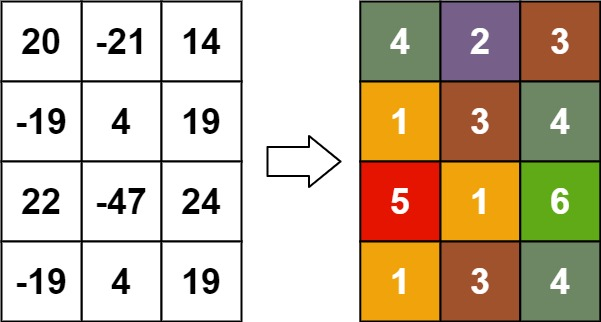
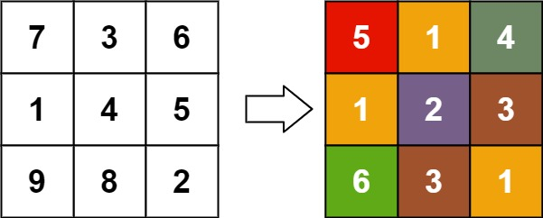

# 并查集

## 一、作用

描述不同元素之间的“关系”

并查集能一些类似连通块的问题，比如  
1. 如何快速张三和李四是不是同个家族的。  
2. 如何快速合并张三和李四两个家族（两个人不同家族）。

## 二、示例代码

=== "普通"

    ```python
    class UnionFind:
        def __init__(self, n: int):
            self.parent = list(range(n))    # parent[x]表示x的长辈是parent[x]，默认是自己
        
        # 寻找x的长辈
        def find(self, x: int) -> int:
            return x if self.parent[x] == x else self.find(self.parent[x])

        # 将x和y他们所处的家族合并 `x合并到y`
        def merge(self, x: int, y: int) -> None:
            self.parent[self.find(x)] = self.find(y)
    ```

=== "优化"

    ```python
    class UnionFind:
        def __init__(self, n: int):
            self.parent = list(range(n))    # parent[x]表示x的长辈是parent[x]，默认是自己
            self.rank = [0] * n             # rank[x]表示x的辈分,值越大则辈分越高，默认是0
        
        # 寻找x的长辈(路径压缩)
        def find(self, x: int) -> int:
            if self.parent[x] != x:
                self.parent[x] = self.find(self.parent[x])
            return self.parent[x]

        # 将x和y他们所处的家族合并(启发式合并)
        def merge(self, x: int, y: int) -> None:
            x, y = self.find(x), self.find(y)
            if x == y:
                return
            if self.rank[x] > self.rank[y]:
                self.parent[y] = x
            elif self.rank[x] < self.rank[y]:
                self.parent[x] = y
            else:
                self.parent[y] = x
                self.rank[x] += 1
    ```


## [矩阵转换后的秩](https://leetcode.cn/problems/rank-transform-of-a-matrix/)

给你一个 m x n 的矩阵 matrix ，请你返回一个新的矩阵 answer ，其中 answer[row][col] 是 matrix[row][col] 的秩。

每个元素的 秩 是一个整数，表示这个元素相对于其他元素的大小关系，它按照如下规则计算：

秩是从 1 开始的一个整数。
如果两个元素 p 和 q 在 同一行 或者 同一列 ，那么：
如果 p < q ，那么 rank(p) < rank(q)
如果 p == q ，那么 rank(p) == rank(q)
如果 p > q ，那么 rank(p) > rank(q)
秩 需要越 小 越好。
题目保证按照上面规则 answer 数组是唯一的。


**示例 1：**

    输入：matrix = [[1,2],[3,4]]
    输出：[[1,2],[2,3]]
    解释：
    matrix[0][0] 的秩为 1 ，因为它是所在行和列的最小整数。
    matrix[0][1] 的秩为 2 ，因为 matrix[0][1] > matrix[0][0] 且 matrix[0][0] 的秩为 1 。
    matrix[1][0] 的秩为 2 ，因为 matrix[1][0] > matrix[0][0] 且 matrix[0][0] 的秩为 1 。
    matrix[1][1] 的秩为 3 ，因为 matrix[1][1] > matrix[0][1]， matrix[1][1] > matrix[1][0] 且 matrix[0][1] 和 matrix[1][0] 的秩都为 2 。


**示例 2：**

    输入：matrix = [[7,7],[7,7]]
    输出：[[1,1],[1,1]]


**示例 3：**

    输入：matrix = [[20,-21,14],[-19,4,19],[22,-47,24],[-19,4,19]]
    输出：[[4,2,3],[1,3,4],[5,1,6],[1,3,4]]


**示例 4：**

    输入：matrix = [[7,3,6],[1,4,5],[9,8,2]]
    输出：[[5,1,4],[1,2,3],[6,3,1]]



>提示：  
>m == matrix.length  
>n == matrix[i].length  
>1 <= m, n <= 500  
>-109 <= matrix[row][col] <= 109


??? tip "思路"

    1. 根据值从小到大排序，相同的值合并成列表
    2. 从小到大遍历。用并查集合并`行列相同`的值为一组（难点）
    3. 遍历每一组的值，统计组内元素所处的行列的最大值
    4. 赋值


??? example "示例代码"

    ```python
    class Solution:
        def matrixRankTransform(self, matrix: List[List[int]]) -> List[List[int]]:
            # 同值合并
            d=defaultdict(list)
            for i in range(len(matrix)):
                for j in range(len(matrix[0])):
                    d[matrix[i][j]].append([i,j]) 

            line,column=[0]*len(matrix),[0]*len(matrix[0])
            for x in sorted(d.keys()):
                uf=UnionFind(len(matrix)+len(matrix[0]))
                
                # 同一行/同一列合并
                for r,c in d[x]:
                    uf.merge(r,c+len(matrix)) 
                
                # 根据列分组
                groups=defaultdict(list) 
                for r,c in d[x]:
                    groups[uf.find(r)].append([r,c])

                
                for i in groups.keys():
                    rank=0
                    # 获取同组的最大rank
                    for r,c in groups[i]:
                        rank=max(rank,line[r]+1,column[c]+1)
                    
                    # 赋值
                    for r,c in groups[i]:
                        matrix[r][c]=rank
                        line[r]=rank
                        column[c]=rank
            return matrix
    ```