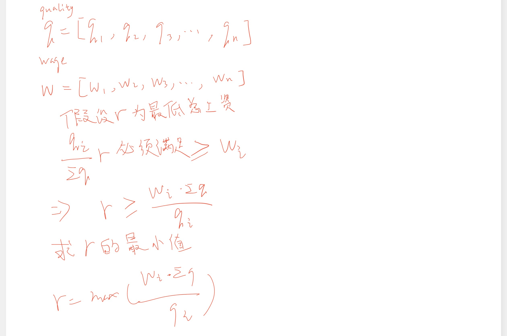

# 数学

## [雇佣 K 名工人的最低成本](https://leetcode.cn/problems/minimum-cost-to-hire-k-workers/)
---
√

有 n 名工人。 给定两个数组 quality 和 wage ，其中，quality[i] 表示第 i 名工人的工作质量，其最低期望工资为 wage[i] 。

现在我们想雇佣 k 名工人组成一个工资组。在雇佣 一组 k 名工人时，我们必须按照下述规则向他们支付工资：

对工资组中的每名工人，应当按其工作质量与同组其他工人的工作质量的比例来支付工资。
工资组中的每名工人至少应当得到他们的最低期望工资。
给定整数 k ，返回 组成满足上述条件的付费群体所需的最小金额 。在实际答案的 10-5 以内的答案将被接受。。

 
**示例 1：**

    输入： quality = [10,20,5], wage = [70,50,30], k = 2  
    输出： 105.00000  
    解释： 我们向 0 号工人支付 70，向 2 号工人支付 35。

**示例 2：**

    输入： quality = [3,1,10,10,1], wage = [4,8,2,2,7], k = 3  
    输出： 30.66667  
    解释： 我们向 0 号工人支付 4，向 2 号和 3 号分别支付 13.33333。
     

>提示：  
>n == quality.length == wage.length  
>1 <= k <= n <= 104

??? tip "思路"
    堆
    
    
??? example "示例代码"

    ```python
    class Solution:
        def mincostToHireWorkers(self, quality: List[int], wage: List[int], k: int) -> float:
            maxHeap=[]
            wq=sorted(zip(wage,quality),key=lambda x:x[0]/x[1])
            sumQ=0
            res=math.inf
            for w,q in wq[:k-1]:
                sumQ+=q
                heappush(maxHeap,-q)
            
            for w,q in wq[k-1:]:
                sumQ+=q
                heappush(maxHeap,-q)
                res=min(res,w / q *sumQ)
                sumQ+=heappop(maxHeap)
            
            return res
    ```

## [得到连续 K 个 1 的最少相邻交换次数](https://leetcode.cn/problems/minimum-adjacent-swaps-for-k-consecutive-ones/)
---
给你一个整数数组 nums 和一个整数 k 。 nums 仅包含 0 和 1 。每一次移动，你可以选择 相邻 两个数字并将它们交换。

请你返回使 nums 中包含 k 个 连续 1 的 最少 交换次数。
 
**示例 1：**

    输入：nums = [1,0,0,1,0,1], k = 2
    输出：1
    解释：在第一次操作时，nums 可以变成 [1,0,0,0,1,1] 得到连续两个 1 。

**示例 2：**

    输入：nums = [1,0,0,0,0,0,1,1], k = 3
    输出：5
    解释：通过 5 次操作，最左边的 1 可以移到右边直到 nums 变为 [0,0,0,0,0,1,1,1] 。

**示例 3：**

    输入：nums = [1,1,0,1], k = 2
    输出：0
    解释：nums 已经有连续 2 个 1 了。
 
>提示：  
>1 <= nums.length <= 105  
>nums[i] 要么是 0 ，要么是 1 。  
>1 <= k <= sum(nums)  

??? tip "思路"

    设1的下标为$p_0,p_1,…,p_m$，将其中$k$个1(从$i$开始，到$i+k-1$)搬到下标从$q$开始的位置则交换次数为：

    $$
    \sum_{j=i}^{i+k-1}{|q+j-i-p_j|} = \sum_{j=i}^{i+k-1}{|q-i-(p_j-j)|}
    $$
    
    这里$i$,$q$是自变量

    由于$p_j-j$非递减，那么要使交换次数取得最小值，则$q-i$等于$\frac{p_j-j}{2}$
    
    设$mid=\frac{p_j-j}{2}$,则

    $$
    \begin{aligned}
    \sum_{j=i}^{i+k-1}{|q-i-(p_j-j)|}&=\sum_{j=i}^{mid-1}{(p_j-j)-(q-i)}+\sum_{j=mid}^{i+k-1}{(q-i)-(p_j-j)} \\
    &=\sum_{j=i}^{mid-1}{-(q-i)}+\sum_{j=i}^{mid-1}{p_j-j}
    \end{aligned}
    $$


??? example "示例代码"

    ```python
    class Solution:
        def minMoves(self, nums: List[int], k: int) -> int:
            g, preSum = [], [0]
            for i, num in enumerate(nums):
                if num == 1:
                    g.append(i - len(g))
                    preSum.append(preSum[-1] + g[-1])
            m, res = len(g), inf
            for i in range(m - k + 1):
                mid = i + k // 2
                r = g[mid]
                res = min(res, (1 - k % 2) * r + (preSum[i + k] - preSum[mid + 1]) - (preSum[mid] - preSum[i]))
            return res
    ```